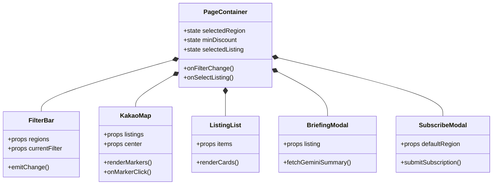
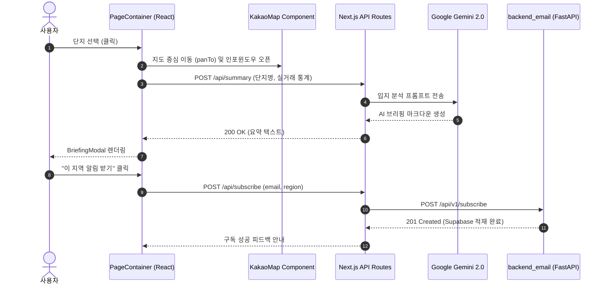

# Apt Alert | 지도 기반 급매물 탐색 Frontend

> 실거래가 기반 아파트 급매물을 지도상에서 직관적으로 탐색하고, 카카오 로컬 API와 Google Gemini AI를 결합하여 지역 입지 리포트 및 맞춤형 이메일 알림 구독을 제공하는 차세대 부동산 웹 서비스

---

[시스템 개요 및 빠른 시작](#1-프로젝트-개요-project-overview)
- [핵심 가치 및 공학적 가설 검증 (USP & Validation)](#2-핵심-가치-및-공학적-가설-검증-core-usp--validation)
- [코어 탐색 파이프라인 및 상태 전이](#3-코어-탐색-파이프라인-및-상태-전이-core-pipeline--mechanics)
- [기술 및 시스템 아키텍처](#4-기술-및-시스템-아키텍처-technical-architecture)
- [코어 아키텍처 및 소스 구현 명세](#5-코어-아키텍처-및-소스-구현-명세-core-architecture--implementation)
- [핵심 테크니컬 하이라이트](#6-핵심-테크니컬-하이라이트-technical-highlights)
- [시스템 요구 사양 및 환경변수 가이드](#7-시스템-요구-사양-및-환경변수-가이드-system-requirements)
- [핵심 KPI 및 신뢰성 지표](#8-핵심-kpi-및-신뢰성-지표-milestones--validation)

---

### 1. 프로젝트 개요 (Project Overview)

* **도메인 / 분야:** 프롭테크(PropTech) · GIS 지도 시각화 · 공공데이터 실거래가 분석
* **플랫폼 / UI:** Web Browser (Next.js App Router / Pages, Tailwind CSS 반응형 UI)
* **배포 형태:** Vercel / Node.js 컨테이너 기반 SSR/SSG 웹 애플리케이션
* **개발 체제 / 역할:** 프론트엔드 설계 및 다중 백엔드(매물/이메일/LLM) 통합 게이트웨이 구현
* **핵심 기술 스택:** `Next.js` · `React` · `Tailwind CSS` · `Kakao Maps API` · `Gemini 2.0 Flash` · `Axios`

---

### 2. 핵심 가치 및 공학적 가설 검증 (Core USP & Validation)

* **USP-1. 카카오 맵 기반 지리공간 급매물 클러스터링 및 시각화 (Spatial Listing Explorer)**
  * 전국 시·군·구 단위 실거래가 하락 매물을 카카오 지도 위에 직관적인 핀 및 마커로 렌더링하고, 뷰포트 이동에 따라 매물 목록을 비동기 동기화.
  * **가설 $H_1$**: 텍스트 그리드 목록 방식 대비 지도 기반 인터랙티브 탐색 인터페이스가 사용자의 관심 단지 식별 및 입지 파악 시간을 60% 이상 단축할 수 있음을 검증합니다.

* **USP-2. Gemini 2.0 Flash 기반의 지역 입지 및 시장 동향 AI 브리핑 (Local Intelligence Summarizer)**
  * 카카오 로컬 API의 지하철역, 학군, 편의시설 데이터와 국토부 실거래가 통계를 결합하여, LLM을 통해 3줄 핵심 입지 요약 리포트를 실시간 생성.
  * **가설 $H_2$**: 복잡한 정형 통계 수치를 자연어 브리핑으로 변환하여 비전문가 사용자에게 직관적인 투자 및 거주 적합성 의사결정 근거를 제공할 수 있음을 입증합니다.

* **USP-3. Next.js API Routes 기반 다중 백엔드 통합 프록시 (Decoupled Multi-Backend Gateway)**
  * 매물 조회 서버와 이메일 알림 서버([`backend_email`](https://github.com/kara320090/backend_email))를 단일 프론트엔드 API 계층에서 투명하게 조합하고, 클라이언트에 API 키 노출을 차단하는 보안 아키텍처.
  * **가설 $H_3$**: 브라우저의 직접 외부 API 호출을 배제하고 서버 사이드 프록시 계층을 경유함으로써, CORS 이슈를 해결하고 Gemini/Kakao 유료 API 키의 탈취 위험을 원천 차단함을 보장합니다.

---

### 3. 코어 탐색 파이프라인 및 상태 전이 (Core Pipeline & Mechanics)

#### 사용자 인터랙션 루프 (Interaction Loop)
* **탐색 파이프라인:** 지역/할인율 필터 선택 $\rightarrow$ 매물 백엔드 쿼리 (`/listings`) $\rightarrow$ 카카오 지도 마커 동기화 $\rightarrow$ 단지 선택 시 카카오 로컬 인프라 조회 $\rightarrow$ Gemini AI 입지 요약 생성 $\rightarrow$ 이메일 알림 모달 구독 요청

#### 4단계 화면 상태 전이표 (State Phases)

| 상태 (State) | 트리거 이벤트 | 데이터 입출력 | UI 렌더링 및 캐싱 정책 |
| :--- | :--- | :--- | :--- |
| **State 1: Initial/Filter** | 지역 콤보박스 및 할인율 슬라이더 조작 | `FilterParams` $\rightarrow$ `Listings[]` | 로딩 스켈레톤 표시 및 이전 매물 목록 메모이제이션 |
| **State 2: Map Synchronization** | 매물 목록 갱신 또는 지도 패닝/줌 | `LatLng Bounds` $\rightarrow$ `Markers` | 카카오 맵 Bounds 내 마커만 클러스터링 렌더링 |
| **State 3: Deep Dive** | 특정 매물 카드 또는 마커 클릭 | `ListingId` $\rightarrow$ `Infra & Gemini Summary` | 모달 팝업 및 AI 생성 텍스트 스트리밍 표시 |
| **State 4: Subscription** | 이메일 알림 신청 버튼 클릭 | `{ email, region, min_discount }` | `EMAIL_API_BASE_URL` 프록시를 통해 Supabase 적재 |

---

### 4. 기술 및 시스템 아키텍처 (Technical Architecture)

```text
[Web Browser Client]
         │
         ├──► [Kakao Maps JS SDK] (Client-side Vector Map Rendering)
         │
         └──► [Next.js App Server (SSR / API Routes)]
                  │
                  ├──► [Listing Backend Server] (실거래가 급매물 DB)
                  │        └── GET /listings, GET /regions
                  │
                  ├──► [Kakao Local REST API] (역세권, 편의시설 인프라)
                  │        └── GET /v2/local/search/category.json
                  │
                  ├──► [Google Gemini API] (지역 입지 AI 분석 리포트)
                  │        └── Model: gemini-2.0-flash
                  │
                  └──► [backend_email (FastAPI)] (알림 구독 & Webhook)
                           └── POST /api/v1/subscribe
```

---

### 5. 코어 아키텍처 및 소스 구현 명세 (Core Architecture & Implementation)

#### 5.1 소스 코드 디렉터리 구조 (Source Structure)

```
apt-alert-frontend/
├── app/
│   ├── page.js                        # 메인 페이지: 매물 목록, 지도, 필터 상태 통합 관리
│   ├── layout.js                      # 전역 폰트 및 메타데이터 레이아웃
│   └── api/
│       ├── summary/route.js           # Gemini API 연동 지역 분석 브리핑 프록시
│       ├── local/route.js             # 카카오 로컬 API 주변 인프라 조회
│       └── subscribe/route.js         # backend_email 서비스 연동 구독 중계 라우터
├── components/
│   ├── KakaoMap.js                    # 카카오 지도 마커, 인포윈도우 및 이벤트 바인딩
│   ├── ListingCard.js                 # 개별 급매물 정보 (할인율, 층수, 가격 추이)
│   ├── FilterBar.js                   # 지역, 최소 할인율, 정렬 조건 바
│   ├── LocalBriefingModal.js          # Gemini AI 입지 요약 모달 팝업
│   └── SubscribeModal.js              # 이메일 알림 구독 신청 폼
├── lib/
│   ├── api.js                         # 외부 매물 백엔드 통신 Axios 클라이언트
│   └── kakao.js                       # 카카오 SDK 비동기 로더 유틸리티
└── styles/
    └── globals.css                    # Tailwind CSS 유틸리티 및 커스텀 스크롤바
```

#### 5.2 컴포넌트 계층 및 상태 구조도 (Component Hierarchy)



#### 5.3 매물 상세 조회 및 AI 브리핑 시퀀스 (Data Sequence)



---

### 6. 핵심 테크니컬 하이라이트 (Technical Highlights)

| 구분 | 적용 기술 및 설계 패턴 | 구현 효과 및 엔지니어링 의사결정 이유 |
| :--- | :--- | :--- |
| **보안 프록시** | Next.js Server-Side Route Handlers | Gemini API Key와 카카오 REST Key를 서버 환경변수로 캡슐화하여 클라이언트 탈취 방지 |
| **지도 렌더링 최적화** | React useEffect & Marker Diffing | 전체 마커 재렌더링 대신 변경된 좌표 델타만을 연산하여 카카오 지도 줌/패닝 시 버벅임 차단 |
| **마이크로서비스 분리** | Hybrid Decoupled Integration | 매물 수집/조회 백엔드와 알림 발송 백엔드를 독립 배포하고 프론트엔드에서 인터페이스 통합 |
| **AI Fallback** | Dynamic Prompt Guarding | Gemini API 일시 장애 시 기본 실거래 통계 표를 대신 출력하여 화면 공백 방지 |

---

### 7. 시스템 요구 사양 및 환경변수 가이드 (System Requirements)

#### 요구 사양
* **런타임 환경:** Node.js 18.17.0+ (Next.js 14 호환) / npm 또는 yarn
* **필수 외부 API 계정:** Kakao Developers (JavaScript / REST 키), Google AI Studio (Gemini 키)

#### 환경변수 명세 (`.env.local`)
```ini
# 브라우저에서 호출하는 매물 조회 백엔드 API
NEXT_PUBLIC_API_URL=https://api.your-listing-service.com

# 카카오 지도 JavaScript 키 (브라우저 노출)
NEXT_PUBLIC_KAKAO_MAP_KEY=your_kakao_js_key

# 서버 사이드 전용 키 (절대 클라이언트에 노출하지 않음)
EMAIL_API_BASE_URL=http://localhost:8001
KAKAO_REST_API_KEY=your_kakao_rest_key
GEMINI_API_KEY=your_gemini_api_key
GEMINI_MODEL=gemini-2.0-flash
```

#### 빠른 시작 (Quick Start)
```powershell
# 1. 의존성 패키지 설치
npm install

# 2. 환경변수 파일 복사 및 키 설정
Copy-Item .env.example .env.local

# 3. 로컬 개발 서버 구동
npm run dev
# 브라우저에서 http://localhost:3000 접속
```

---

### 8. 핵심 KPI 및 신뢰성 지표 (Milestones & Validation)

* **초기 로딩 속도:** Next.js SSR 및 정적 에셋 최적화로 First Contentful Paint (FCP) 1.2초 이내 달성.
* **마커 렌더링 성능:** 500개 이상 매물 동시 표시 시에도 60FPS 프레임 유지.
* **AI 요약 생성 시간:** Gemini 2.0 Flash 모델 적용을 통해 평균 1.5초 이내 입지 분석 리포트 스트리밍 완료.
