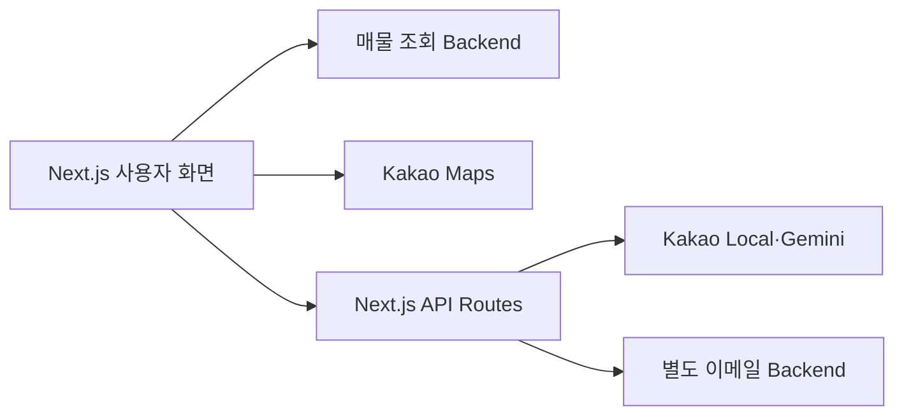

# Apt Alert | 지도 기반 급매물 탐색 Frontend

지역·등급·할인율 조건으로 매물을 살펴보고, 지도와 입지 정보, 지역 요약, 이메일 구독을 함께 이용하는 웹 화면입니다.

**Next.js · React · Tailwind CSS · Kakao Maps/Local API · Gemini API**

## 주요 기능

- 지역과 할인 조건을 기준으로 매물 목록 필터링
- 카카오 지도에 매물 위치 표시
- 카카오 로컬 데이터 기반 입지 태그
- 지역 리포트와 Gemini 기반 요약
- 이메일 알림 구독·해제 API 연결

## 서비스 연결 구조



매물 조회 서버와 이메일 서버를 구분합니다. [`backend_email`](https://github.com/kara320090/backend_email)은 구독·메일 처리용 저장소이며 매물 수집·조회 API 전체를 대신하지 않습니다.

## 로컬 실행

Node.js/npm과 프로젝트 의존성에 맞는 실행 환경을 준비하고 저장소 루트에서 실행합니다.

```powershell
npm install
Copy-Item .env.example .env.local
# .env.local에 필요한 API 주소와 키를 입력합니다.
npm run dev
```

접속 주소는 `http://localhost:3000`입니다. 빌드는 `npm run build`, 빌드 결과 실행은 `npm start`입니다.

## 환경변수

| 이름 | 사용 위치·용도 |
|---|---|
| `NEXT_PUBLIC_API_URL` | 브라우저에서 호출하는 매물 조회 Backend |
| `NEXT_PUBLIC_KAKAO_MAP_KEY` | 지도 JavaScript 키 |
| `EMAIL_API_BASE_URL` | 서버에서 구독·해제 요청을 전달할 이메일 Backend |
| `KAKAO_REST_API_KEY` | 서버의 입지 태그 조회 |
| `GEMINI_API_KEY` | 서버의 지역 요약 호출 (`GOOGLE_API_KEY`도 대체 키로 읽음) |
| `GEMINI_MODEL` | 선택할 모델 이름; 현재 소스 기본값은 `gemini-2.0-flash` |

`EMAIL_API_BASE_URL`은 예시 환경 파일에 없더라도 추가해야 합니다. 현재 구독 프록시는 `API_URL`이나 `NEXT_PUBLIC_API_URL`을 대체 주소로 사용하지 않습니다. 서버 전용 키에는 `NEXT_PUBLIC_` 접두사를 붙이지 않습니다.

## 핵심 코드

| 경로 | 역할 |
|---|---|
| [app/page.js](app/page.js) | 목록·필터·지도 화면 상태 통합 |
| [lib/api.js](lib/api.js) | `/regions`, `/listings`, `/filter` 연동 |
| [components/KakaoMap.js](components/KakaoMap.js) | 지도와 위치 표시 |
| [app/api/ai](app/api/ai/) | 입지 태그·지역 요약 서버 API |
| [app/api/subscribe](app/api/subscribe/) | 이메일 구독 프록시 |
| [app/api/unsubscribe](app/api/unsubscribe/) | 이메일 구독 해제 프록시 |
| [lib/filter.test.js](lib/filter.test.js) | 필터 동작 확인용 코드 |

## 확인할 범위

실제 매물·지도·AI 요약·이메일 기능은 연결할 서버와 API 설정에 따라 달라집니다. 이 README는 화면과 연동 구조를 설명하며, 현재 배포 서버의 가용성이나 실시간 매물 데이터를 보장하지 않습니다.
